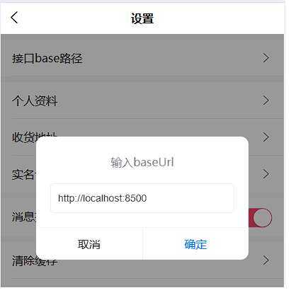

# 声明

本项目就是尚硅谷开源的尚品甄选项目，仅用于本人学习（后端开发）。（侵删）

# 运行引导

## 后台管理系统

### 前端

前端源码：spzx-admin（前端部分不作介绍，详情可自行了解：B站尚硅谷，尚品甄选视频教程。）

==环境请自行搭建，运行之前请注意ip与端口的修改！！！==

后端服务运行在localhost:8502，前端请求路径也已修改为：localhost:8502。

如有需要，请同时修改前后端，否则，直接运行即可。

### 后端

- 后台系统的所有功能都在子模块：spzx-manager

	- 基础环境介绍
		- idea2023
		- JDK17
		- maven进行依赖管理（idea内置）
		- SpringBoot3
		- Spring Cloud Alibaba
	- 服务ip与端口号配置（可自行更改）

	| 服务                        | ip                  | 端口号 | 是否必须修改                 |
	| :-------------------------- | ------------------- | ------ | ---------------------------- |
	| spzx-manager（Application） | 本地：lcoalhost     | 8502   | 否                           |
	| mysql                       | 虚拟机linux（本地） | 3306   | 是（修改为自己服务所在的ip） |
	| redis                       | 虚拟机linux（本地） | 6379   | 是（修改为自己服务所在的ip） |
	| minio                       | 本地：localhost     | 9000   | 否                           |

	```yaml
	server:
	  port: 8502
	# 配置数据库连接信息
	spring:
	  datasource:
	    type: com.zaxxer.hikari.HikariDataSource
	    driver-class-name: com.mysql.cj.jdbc.Driver
	    url: jdbc:mysql://192.168.74.72:3306/db_spzx?characterEncoding=utf-8&useSSL=false&allowPublicKeyRetrieval=true
	    username: root
	    password: 1234
	# Redis的相关配置
	  data:
	    redis:
	      host: 192.168.74.72 #本地虚拟机的ip
	      port: 6379
	  servlet:
	    multipart:
	      max-file-size: 100MB
	# mybatis
	mybatis:
	  config-location: classpath:/mybatis-config.xml
	  mapper-locations: classpath:/mapper/*/*.xml
	# 自定义配置
	spzx:
	  auth:
	    noAuthUrls:
	      - /admin/system/index/login
	      - /admin/system/index/generateValidateCode
	# minio
	  minio:
	    endpointUrl: http://127.0.0.1:9000
	    accessKey: minioadmin
	    secretKey: minioadmin
	    bucketName: spzx-bucket
	```

	

## 前台用户系统

### 前端

前端源码：spzx-h5（前端部分不作介绍，详情可自行了解：B站尚硅谷，尚品甄选视频教程。）

==环境请自行搭建，运行之前请注意修改请求路径！！！==

下图中的请求路径为Gateway（网关）服务所在，前台所有服务都需要通过网关进行路由转发。



### 后端

- SpringCloud微服务

	- nacos实现服务发现与注册

	- OpenFeign实现远程调用

	- Gateway实现路由转发与负载均衡

- 服务ip与端口（可自行更改）

	| 服务            | ip                  | 端口 | 是否必须修改                      |
	| --------------- | ------------------- | ---- | --------------------------------- |
	| nacos           | 虚拟机linux（本地） | 9848 | 是（修改为自己nacos服务所在的ip） |
	| service-order   | 本地：localhost     | 8514 | 否                                |
	| service-pay     | 本地：localhost     | 8515 | 否                                |
	| service-product | 本地：localhost     | 8521 | 否                                |
	| service-user    | 本地：localhost     | 8512 | 否                                |
	| service-cart    | 本地：localhost     | 8513 | 否                                |
	| Gateway         | 本地：localhost     | 8500 | 否                                |
	| mysql与redis    | 与后台数据库一致    |      |                                   |

# 工作日志

# 后台系统

## 1.前端环境搭建

>- 前端项目搭建时，依赖下载太慢，更换淘宝镜像的时候卡住了，直接拿的下载号好的版本
>

## 2.后端环境搭建

>- 项目的构建是一个父工程，包含几个子工程
>
>- 使用了管理依赖，版本锁定的功能，dependencyManagement，期间引入依赖的时候出现了关于==依赖引入==的问题
>
>	1. 首先是远程仓库，这个必须要在settings.xml里配置好，一定要配置正确才能生效。
>
>	2. 在 Maven 中，如果你在 POM 文件中直接引入一个依赖，你必须指定这个依赖的版本，否则 Maven 将无法找到这个依赖。如果你没有指定版本，Maven 将试图下载 "unknown" 版本的依赖，这显然是不存在的，因此你会在本地仓库中看到一个 "unknown" 版本的包，这是一个无效的包。
>
>		在一般情况下，你必须指定依赖的版本，否则 Maven 将无法找到依赖。但是，当你使用父 POM 时，你可以在 `<dependencyManagement>` 中声明依赖的版本，然后在子模块中引用这个依赖而不指定版本。
>
>- 解决了依赖问题后，安装Mysql数据库，redis，利用docker拉取，这里又出现了问题：
>	
>	docker安装完成mysql8，如果使用sqlyog或者navite连接，需要修改密码加密规则，因为低版本客户端工具不支持mysql8最新的加密规则。如果使用客户端连接，需要修改：
>	
>	* docker exec 进入mysql容器
>	
>	* mysql -uroot -p 登录你的 MySQL 数据库，然后 执行这条SQL：
>	
>	```sql
>	ALTER USER 'root'@'%' IDENTIFIED WITH mysql_native_password BY '1234';
>	```
>	
>	然后再重新配置SQLyog的连接，重新填写密码，则可连接成功了。
>	
>- 后端登录接口
>
>	- 这里配置server端口时遇到了冲突，电脑上有个占用了8501的端口，然后将项目的端口改为8502了
>
>	- 在配置mybatis的时候，config属性应该在mapper之前，我写颠倒了，调试了好久才明白，发现自己纠错能力很差，大多数时候都是问gpt，如下是正确顺序，之前颠倒了
>
>		mybatis:
>		  config-location: classpath:/mybatis-config.xml
>		  mapper-locations: classpath:/mapper/*/*.xml
>
>

## 3.登录接口

>- 跟着视频一步步来，没出现什么大问题，就是有些囫囵吞枣，这个项目给了太多现成的东西了，导致没什么参与感，，，，，
>
>- 使用了swagger与knife4j进行接口的测试
>
>- 还有就是用select语句查询时，原本时*，然后改为抽取公共的列，提高复用性，，，
>
>- 异常处理
>
>	统一异常处理
>
>	遇到问题：定义了自定义异常类，并捕获了，也更新了抛出的异常为自定义异常，但是测试时还是原来的异常
>
>	解决：springApplication扫描包只扫描了自己所在的包的bean，本项目它在manager目录
>
>	但是自定义异常在service包，所有没有注册为bean
>
>	@controllerAdvice也就无效了，所以没法捕获
>
>	因此手动开启包的扫描
>
>	```
>	@SpringBootApplication
>	@ComponentScan(basePackages = {"com.spzx"})
>	public class ManagerApplication {
>	    public static void main(String[] args) {
>	        SpringApplication.run(ManagerApplication.class,args);
>	    }
>	}
>	```
>
>	详解：
>
>	Spring Boot 在启动时默认会扫描启动类所在的包以及其子包中的所有组件。启动类就是包含 `public static void main(String[] args)` 方法，并使用 `@SpringBootApplication` 注解的类。
>
>	Spring Boot 的 `@ComponentScan` 注解可以指定一个或多个包来进行组件扫描。当你在 `@ComponentScan` 注解中指定 `basePackages = {"com.spzx"}` 时，Spring Boot 会扫描 `com.spzx` 包以及其所有子包中的所有类，并检查它们是否带有特定的注解（例如 `@Component`、`@Service`、`@Controller`、`@Repository` 等）。如果类带有这些注解，Spring Boot 就会将它们注册为应用程序上下文中的 beans。
>
>	现在，关于你的问题，即使 `com.spzx` 包在两个不同的模块中，只要这两个模块都是你的 Spring Boot 应用程序的一部分，Spring Boot 就能扫描到它们。这是因为在 Java 中，包名是全局唯一的，不同的模块可以有相同的包名。当你构建你的应用程序时，所有的模块都会被编译并打包到一个单一的可执行 JAR 文件中。因此，从 Spring Boot 的角度来看，它可以看到的是一个包含所有模块类的单一类路径，而不是多个独立的模块。
>
>	所以，即使 `com.spzx` 包在两个不同的模块中，只要这两个模块都被包含在你的 Spring Boot 应用程序中，Spring Boot 就能扫描到 `com.spzx` 包中的所有类。
>
>- 修改前端，发现跨域问题
>
>通过配置类实现WebMvcConfigurer接口解决
>
>```java
>public class WebMvcConfiguration implements WebMvcConfigurer {
>   //跨域解决
>   @Override
>    public void addCorsMappings(CorsRegistry registry) {
>        registry.addMapping("/**")      // 添加路径规则
>                .allowCredentials(true)               // 是否允许在跨域的情况下传递Cookie
>                .allowedOriginPatterns("*")           // 允许请求来源的域规则
>                .allowedMethods("*")
>                .allowedHeaders("*") ;                // 允许所有的请求头
>    }
> }
> ```
>
>
>
>- 验证码
>
>	在IndexController添加生成图片验证码的请求映射，添加相应的service层方法（别忘记@Service与@AutoWired）
>
>	==莫名其妙无法连接redis，重启虚拟机得以连接==
>
>- 登录后获取userinfo
>
>## 知识点
>
>一个项目中所涉及到的实体类往往有三种：（本项目中大量使用了以下实体类）
>
>1、封装请求参数的实体类：这种实体类在定义的时候往往会携带到dto【数据传输对象：Data Transfer Object】字样，会定义在dto包中
>
>2、与数据库对应的实体类：这种实体类往往和数据表名称保证一致，会定义在domain、entity、pojo包中
>
>3、封装响应结果的实体类：这种实体类在定义的时候往往会携带到vo【视图对象：View Object】字样，会定义在vo包中

### 退出功能

### ThreadLocal+拦截器登录校验，

>自定义拦截器，实现HandlerInterceptor接口
>
>三个方法分别对应：方法之前，方法之后，所有都完成
>
>```
>public interface HandlerInterceptor {
>default boolean preHandle(HttpServletRequest request, HttpServletResponse response, Object handler) throws Exception {
>return true;
>}
>
>default void postHandle(HttpServletRequest request, HttpServletResponse response, Object handler, @Nullable ModelAndView modelAndView) throws Exception {
>}
>
>default void afterCompletion(HttpServletRequest request, HttpServletResponse response, Object handler, @Nullable Exception ex) throws Exception {
>}
>}
>```
>
>- addInterceptors 注册拦截器
>
>	重写WebMvcConfigurer接口中方法
>
>	优化：
>
>	​	拦截器优化：将路径信息存储在配置文件中
>
>	​	userInfo：直接通过ThreadLocal获取SysUser
>
>	```java
>	@Component
>	public class WebMvcConfiguration implements WebMvcConfigurer {
>					
>	    @Autowired
>	    LoginAuthInterceptor loginAuthInterceptor;
>					
>	    //注入不拦截的路径信息
>	    @Autowired
>	    UserProperties userProperties;
>					
>	    @Override
>	    public void addInterceptors(InterceptorRegistry registry) {
>	        registry.addInterceptor(loginAuthInterceptor)
>	                .excludePathPatterns(userProperties.getNoAuthUrls())
>	                .addPathPatterns("/**");
>	    }
>					
>	    //跨域解决
>	    @Override
>	    public void addCorsMappings(CorsRegistry registry) {
>	        registry.addMapping("/**")      // 添加路径规则
>	                .allowCredentials(true)               // 是否允许在跨域的情况下传递Cookie
>	                .allowedOriginPatterns("*")           // 允许请求来源的域规则
>	                .allowedMethods("*")
>	                .allowedHeaders("*") ;                // 允许所有的请求头
>	    }
>	}
>	```
>
>

## 4.权限管理

>- 添加分页插件的依赖和插件
>
>```
>   //角色列表分页查询
>    @PostMapping("/findByPage/{current}/{limit}")
>    public Result findByPage(@PathVariable("current")Integer current){
>
>    }
>```
>
>- ==角色管理==
>
>	- 获取列表
>
>		又是bug~
>
>		教程给出的代码，请求方式写成了get，应改为post
>
>		queryDto的类型应该是data，（教程写成了param）
>	
>	controller获取参数名字写错了，以后就复制粘贴。
>	
>- 添加角色
>
> 前端都是复制粘贴，老是出错，，，需要仔细一些。
>
>- 修改角色
>
>	前端通过插槽获取，对象扩展运算符
>
>	后端：mapper.xml中，
>
>	**在 SQL 语句中，字符串通常用单引号(')来表示。例如：**
>
>	```sql
>	SELECT * FROM users WHERE name = 'John Doe';
>	```
>
>	在这个例子中，`'John Doe'` 是一个字符串，它被单引号包围。
>
>	双引号(")在 SQL 中通常用于标识标识符，如表名或列名，特别是当它们包含特殊字符或与 SQL 关键字冲突时。例如：
>
>	```sql
>	SELECT "firstName", "lastName" FROM "users";
>	```
>
>	在未修改前端之前，修改和添加调用的都是同一个框，为什么添加的弹框提交后可以插入，修改的不能插入：
>
>	因为修改的时候获取了当前用户的所有信息，包括id，所以向数据库中插入已经存在的id显然是不正确的。
>
>- 删除角色：逻辑删除，deleted=1
>
>- ==用户管理==
>
>- 查询用户列表
>
>
><=符合替换成特殊字符
>
>是的，你的理解是正确的。
>
>在 HTTP 请求中，`GET` 方法通常用于获取数据，而 `POST` 方法通常用于提交数据。在 `GET` 请求中，参数通常通过 URL 的查询字符串（`params`）传递，而在 `POST` 请求中，参数通常通过请求体（`data` 或 `body`）传递。
>
>在你的例子中，如果你改为 `POST` 请求，那么你应该将 ==`params`== 改为 ==`data`==，并在后端使用 `@RequestBody` 注解来接收数据。这是因为 ==`@RequestBody` 注解会告诉 Spring Boot 从请求体中读取数据，而不是从查询字符串或路径参数中读取。==
>
>- 增加用户
>
>
>写完前后端后发现无法添加，调试后sql语句会执行，有信息输出，但也是sql语句操作的时候出了问题
>
>观看直播发现少了一个字段status的设置，前端没发送，后端没添加，但这个字段不能为空，所以报错。
>
>但这是看直播发现，没有自己调试出来
>
>==关键原因：要开启报错信息输出，在全局异常处理打印异常信息！这说明异常信息很重要，日志很重要==
>
>- 改、删用户
>
>- 头像功能
>
>
>minio ->bucket，每次启动端口不一，但可以始终通过9000端口登录，需要启动才能用（一个存储库）
>
>完成文件上传接口：流的方式上传
>
>优化：将地址，名字这些写在配置文件中 | 给每个上传文件都生成一个独有的名字，根据当前日期进行分组
>
>完成图片上传，更新却失败：更新语句竟然没有avatar更新，增加之后成功
>
>- ==分配角色==
>
>
>查询角色，角色回显，保存角色信息

## 5.菜单管理

>- ==菜单列表==
>
>	`resultMap` 是 MyBatis 的一个强大特性，它允许你从数据库结果集中映射对象，这比简单地使用列名和实体类属性名的对应更加灵活和强大。以下是使用 `resultMap` 的一些原因：
>
>	1. **列名和属性名不匹配**：如果数据库表的列名和 Java 实体类的属性名不完全匹配，你可以使用 `resultMap` 来定义映射关系。例如，数据库表可能有一个名为 `user_name` 的列，而你的 Java 实体类有一个名为 `username` 的属性。在这种情况下，你可以使用 `resultMap` 来定义这两者之间的映射关系。
>
>	2. **高级映射**：`resultMap` 还可以处理更复杂的映射，如一对一、一对多、多对多等关系。例如，你可能有一个 `Order` 类，它包含一个 `User` 对象和一个 `Item` 对象列表。你可以使用 `resultMap` 来定义这些对象之间的映射关系。
>
>	3. **继承关系**：如果你的 Java 类有继承关系，`resultMap` 也可以帮助你处理这种情况。例如，你可能有一个 `Employee` 类，它继承自 `Person` 类。你可以使用 `resultMap` 来定义 `Person` 和 `Employee` 之间的映射关系。
>
>	4. **自定义类型处理器**：如果你需要将数据库列映射到自定义的 Java 类型，你也可以使用 `resultMap`。例如，你可能有一个数据库列存储的是 JSON 字符串，你希望将其映射到一个 Java 对象。你可以在 `resultMap` 中使用自定义的类型处理器来实现这种映射。
>
>	因此，尽管在简单的情况下，直接使用实体类可能更简单，但在复杂的情况下，`resultMap` 提供了更大的灵活性和控制力。
>
>- 菜单管理：增删改查
>
>- 角色分配菜单
>
>	菜单回显
>
>	保存分配：is_half：全选，非全选
>
>- 动态菜单
>
>	没跟着视频，自己写没写好，能力有待锻炼
>
>	==有个小bug，后续解决==

## 6.分类管理

>- 分类列表
>
>- 导入Excel：EasyExcel
>
>	导入数据，EasyExcel，监听器
>
>	前端复制粘贴时，端口号没改：注意端口号
>
>- 品牌管理
>
>	- 品牌列表
>
>	- 增加品牌
>
>	- 修改品牌
>
>		sql语句编写时出了问题，
>
>		```
>		 <if test=" name!=null and name!=''">
>		            name = #{name},
>		        </if>
>		```
>
>		==运算符号：and不能大写==
>
>		==为什么不能使用大写的 `AND`，这是因为 OGNL 的语法规定逻辑运算符必须是小写的。在 OGNL 中，`and`、`or` 和 `not` 都必须是小写的。如果你使用大写的 `AND`，OGNL 解析器会将其视为一个标识符，而不是一个逻辑运算符，从而导致语法错误。==
>
>- 分类品牌管理
>
>	- 列表查询
>	- 添加，修改，删除
>
>- 商品规格管理
>
>	- 列表，添加，修改，删除

## 7.商品管理

>- 不知道为什么同源禁止策略时不时出现问题：解决办法，用头像测试一次，再测试其他的
>
>	明白了，原来不是同源禁止策略，是图片太大了，上传不了
>
>	可以通过修改Multifile的最大文件大小实现大图片上传：
>
>	```
>	  servlet:
>	    multipart:
>	      max-file-size: 100MB
>	```
>
>	- 上传图片的名字也有限制：因为数据库存的是链接，一串可变字符，不能大于255，所以图片的名字不能太长
>
>- 列表查询：sql语句的书写
>
>- 添加功能：多表查询：sql语句书写（图片问题在这里出现，解决）
>
>	sku，spu
>
>- 回显，修改，删除
>
>- 审核，上下架

## 8.订单管理

>- Echars图表显示数据
>
>- 订单总金额：
>
> 统计每天的总金额，sql语句查询，根据格式化后的日期分组
>
> - 问题：如果订单量很大，每次都进行分组查询效率较低
>
> - 可以采用定时任务：将分组结果计算号，写入到一张数据统计结果表中，然后从该表中直接查询统计结果。这个统计结果表由定时任务维护
>
>- Spring Task：定时任务实现
>
>	```java
>	//@EnableScheduling//启动定时任务,在启动类添加
>	//@Scheduled(cron = "0/5 * * * * ?")  // 定义定时任务，使用@Scheduled注解指定调度时间表达式
>	    public void helloWorldTask() {
>	        System.out.printf("HelloWorld");
>	    }
>	```
>
>	cron在线表达式：到spring里要变成6位，不支持年
>
>- 金额统计：定时任务统计每天的记录总金额，并将金额加入到统计结果集中
>
>- 金额查询：前端发送查询请求，OrderController控制器响应返回请求的数据
>
>	service查询OrderStatistic里的结果集数据
>
>	statistic放的是每天的总金额，info里放的是每条消费记录。前者就是做个统计而已。

## 9.记录日志

>- 普通记录：
>
>	- 业务方法调用之前处理，记录当前方法名
>		称，参数，用户等信息
>	- service.save(...);//业务方法
>	- 业务方法调用之后处理，记录当前业务方法操作
>		结果，成功还是失败
>
>- 利用AOP增强方法，记录日志
>
>	- 注解
>
>		```
>		@Target({ElementType.METHOD})//表示可以用在什么地方：方法
>		@Retention(RetentionPolicy.RUNTIME)//用在什么时期
>		public @interface Log {     //自定义操作日志注解
>										
>		    public String title() ;								// 模块名称
>		    public OperatorType operatorType() default OperatorType.MANAGE;	// 操作人类别
>		    public int businessType() ;     // 业务类型（0其它 1新增 2修改 3删除）
>		    public boolean isSaveRequestData() default true;   // 是否保存请求的参数
>		    public boolean isSaveResponseData() default true;  // 是否保存响应的参数
>		}
>										
>		```
>
>
>
>	- 切面类环绕通知方法
>					
>		```
>		@Aspect
>		@Component
>		public class AspectLog {
>		    //环绕通知
>		    @Around(value = "@annotation(sysLog)")
>		    public Object doAroundAdvice(ProceedingJoinPoint joinPoint, Log sysLog){
>
>
>		    }
>		}
>		```
>					
>	- 自定义注解，然后添加到启动类，让spring可以扫描到
>					
>		```
>		@Target({ElementType.TYPE})
>		@Retention(RetentionPolicy.RUNTIME)
>		@Import(value = Aspect.class)            // 通过Import注解导入日志切面类到Spring容器中
>		public @interface EnableLogAspect {
>					
>		}
>		```
>
>- 如何在common-log中操作数据库
>
>	- 在common-log中创建接口，定义方法
>	- 在spzx-manager里创建common-log里面interface接口实现类，实现具体操作日志方法
>
>- 对于操作信息的封装，采用了已经给出的工具类，但运行过程发现了问题
>
>	可以采用如下方法结局
>
>	你的代码看起来是在使用 Spring AOP 和自定义注解 `@Log` 来记录方法的执行情况。在方法执行前，`beforeHandleLog` 方法被调用，记录了一些基本的信息，如操作模块名称、请求方法、请求 URL、请求 IP、操作人名称等。在方法执行后，`afterHandlLog` 方法被调用，记录了方法的执行结果和状态。
>
>	你在 `afterHandlLog` 方法中遇到的问题是试图将 `proceed` 对象（类型为 `ProceedingJoinPoint`）序列化为 JSON。如我之前所说，`ProceedingJoinPoint` 对象是 Spring AOP 中的一个类，代表一个正在执行的连接点（如一个方法调用）。这个对象可能包含一些不能被序列化为 JSON 的方法。
>
>	解决这个问题的一种方法是，不要直接将 `ProceedingJoinPoint` 对象序列化为 JSON，而是创建一个新的类，这个类只包含你想要记录的信息。然后，将 `ProceedingJoinPoint` 对象的相关信息复制到这个新的类中，最后将新的类序列化为 JSON。这样，你就可以避免序列化不支持的方法，只记录你感兴趣的信息。
>
>	例如，你可以定义一个 `ProceedingJoinPointInfo` 类，这个类包含了你想要记录的方法名和参数：
>
>	```java
>	public class ProceedingJoinPointInfo {
>	    private String methodName;
>	    private Object[] args;
>					
>	    // getter and setter methods...
>	}
>	```
>
>	然后，在你的 `afterHandlLog` 方法中，你可以创建一个 `ProceedingJoinPointInfo` 对象，并从 `proceed` 对象中获取方法名和参数：
>
>	```java
>	public static void afterHandlLog(Log sysLog, ProceedingJoinPoint proceed,
>	                                 SysOperLog sysOperLog, int status ,
>	                                 String errorMsg) {
>	    if(sysLog.isSaveResponseData()) {
>	        ProceedingJoinPointInfo info = new ProceedingJoinPointInfo();
>	        info.setMethodName(proceed.getSignature().getName());
>	        info.setArgs(proceed.getArgs());
>	        sysOperLog.setJsonResult(JSON.toJSONString(info));
>	    }
>	    sysOperLog.setStatus(status);
>	    sysOperLog.setErrorMsg(errorMsg);
>	}
>	```
>
>	这样，你就可以避免在序列化 `ProceedingJoinPoint` 对象时遇到的问题。

### 事务失效

>
>
>## 1.6 事务失效
>
>当我们自定义了切面类以后，如果不注意异常的处理，那么此时就会出现事务失效的情况。
>
>### 1.6.1 事务失效演示
>
>以给角色分配菜单的代码为例，演示事务失效的问题，代码如下所示：
>
>```java
>// com.atguigu.spzx.manager.service.impl.SysRoleMenuServiceImpl
>@Log(title = "角色菜单模块" , businessType = 2 )		
>@Transactional
>@Override
>public void doAssign(AssginMenuDto assginMenuDto) {
>
>// 根据角色的id删除其所对应的菜单数据
>sysRoleMenuMapper.deleteByRoleId(assginMenuDto.getRoleId());
>
>int a = 1 / 0 ;		// 手动抛出异常
>
>// 获取菜单的id
>List<Map<String, Number>> menuInfo = assginMenuDto.getMenuIdList();
>if(menuInfo != null && menuInfo.size() > 0) {
>   sysRoleMenuMapper.doAssign(assginMenuDto) ;
>}
>
>}
>```
>
>**注意**：不加@Log注解事务可以进行回滚，但是加上该注解以后事务就会失效。
>
>
>
>### 1.6.2 问题分析
>
>Spring的事务控制是通过aop进行实现的，在框架底层会存在一个事务切面类，当业务方法产生异常以后，事务切面类感知到异常以后事务进行回滚。
>
>当系统中存在多个切面类的时候，Spring框架会按照**@Order**注解的值对切面进行排序，@Order的值越小优先级越高，@Order的值越大优先级越低。优先级越高的切面类越优先执行，当我们没有给切面类指定排序值的时候，我们自定义的切面类的优先级和aop切面类的优先级相同，那么此时**事务切面类的优先级要高于自定义切面类**，那么切面类的执行顺序如下所示：
>
> 
>
>当在自定义切面类中对异常进行了捕获，没有将异常进行抛出，那么此时事务切面类是感知不到异常的存在，因此事务失效。
>
>
>
>### 1.6.3 问题解决
>
>解决方案一：使用@Order注解提高自定义切面类的优先级
>
>解决方案二：在自定义切面类的catch中进行异常的抛出
>
>

# 前台系统

## 前端直接搭建

## 后端搭建

>
>
>- 依赖的scope属性
>
>	在Maven中，`<scope>`标签用于指定依赖的范围，它有以下几个可能的值：
>
>	1. `compile`：这是默认的范围，如果没有指定其他范围，那么就会使用这个范围。在这个范围下，依赖在所有的类路径（包括编译、测试、运行等）中都可用。
>
>	2. `provided`：在这个范围下，Maven假设JDK或者容器已经提供了依赖，因此在编译和测试时，依赖会被添加到类路径中，但在打包时，依赖不会被包含进去。这个范围常用于那些在运行环境中已经存在的依赖，例如Servlet API和Java EE API。
>
>	3. `runtime`：在这个范围下，依赖在编译时不会被添加到类路径中，但在测试和运行时会被添加进去。这个范围常用于那些在编译时不需要，但在运行时需要的依赖，例如JDBC驱动。
>
>	4. `test`：在这个范围下，依赖只在测试时被添加到类路径中，不会被添加到编译和运行的类路径中。这个范围常用于那些只在测试时需要的依赖，例如JUnit。
>
>	5. `system`：在这个范围下，Maven不会从仓库中获取依赖，而是从文件系统的特定位置获取。你需要使用`<systemPath>`标签来指定依赖的位置。这个范围通常不建议使用，因为它会使构建过程依赖于特定的文件系统布局。
>
>	6. `import`：这个范围只在`<dependencyManagement>`部分使用，它表示依赖的POM将被替换为在`<dependencyManagement>`部分指定的依赖列表。这个范围主要用于在父POM中管理子模块的版本号。

## 项目实操

  >- ==端口服务比较多，要注意服务运行的ip以及端口号！==
  >
  >- 网关，搭建一个网关
  >
  >	原先服务运行的ip和端口应该设置未SpringBoot运行的ip与端口（本机，8511）
  >
  >	当有网关后，就可以访问网关所在ip就可以了
  >
  >	```
  >	在微服务架构中，通常会使用 API 网关来处理客户端请求。API 网关的主要作用是路由请求到适当的微服务。它在客户端和各个微服务之间充当了一个中间层。
  >	
  >	在没有网关的情况下，客户端需要知道每个微服务的 IP 和端口，才能直接与其通信。这不仅需要客户端管理大量的 IP 和端口信息，而且如果某个服务的 IP 或端口发生变化，客户端也需要相应地更新。
  >	
  >	然而，如果有了 API 网关，情况就会大不相同。客户端只需要知道 API 网关的 IP 和端口，就可以发送请求到任何一个微服务。当 API 网关收到一个请求时，它会根据一定的规则（比如 URL 的路径或请求的参数）将请求路由到适当的微服务。这样，即使某个微服务的 IP 或端口发生变化，客户端也无需知道，因为它始终只与 API 网关通信。
  >	
  >	所以，当你有网关后，你只需要访问网关所在的 IP 和端口，而不需要知道各个微服务的具体 IP 和端口。这大大简化了客户端的工作，并提高了系统的可扩展性和灵活性。
  >	```
  >
  >- nacos运行在8848端口（虚拟机ip！！）
  >
  >- @CrossOrigin//临时解决跨域问题，现在用网关解决

### Redis缓存存储分类数据

>- 分类数据一般情况下不会做过多的修改，因此可以将分类数据进行缓存，以提高页面的加载速度。
>
>- nacos失效，重启！
>
>- 将第一次从mysql里查询到数据返回并将数据存储到redis中，后面的查询都从redis里查询
>
>- Spring-cache
>
>	redis存储的注解开发形式
>
>	加上Cacheable注解，效果同之前的存储到reids中，后续查询都走redis
>
>	```
>	/**
>	     * 获取分类
>	     * @return
>	     */
>	    @Override
>	    @Cacheable(value = "category" ,key = "'all'")
>	    public List<Category> findCategoryTree() {
>	        List<Category> list= categoryMapper.findCategoryAll();
>	        List<Category> treeList = BuildCategoryTreeUtil.buildTree(list, 0L);
>	        return treeList;
>	    }
>	```

## 查询商品详情

>- 纠错：回看manager的查询product详情，发现有部分错误
>
>	在ProductSkuMapper与ProductDetailsMapper里均出现将本该为productId，结果命名为id，修改后如下
>
>	```
>	    //查询商品详情
>	    ProductDetails findProductDetailsById(Long productId);
>					
>	```
>
>
>
>- 点击商品sku分类，不能进行点击，后端是能查出数据的，估计可能是前端问题

## 用户注册

>- 短信服务，两个，按照教程配置成功，另一个失败
>
>- 用@Resource注入redistemplate，存储的是二进制，但明明已经指定类型了
>
>	改为@Autowired后变正常
>
>- 完成注册功能，（密码111111，test，15655761906）

## 用户登录

>- 生成token并返回
>- 校验信息

### 登录后用户信息获取

>- 根据请求头里的token查询用户信息

### 校验用户登录状态

>- 使用网关过滤登录请求
>
>	凡是请求*/auth/** 路径下的资源必须为登录状态
>
>	- 自定义过滤器校验
>
>- 校验登录状态，TheadLocal+全局
>
>- 校验登录：根据token获取会员信息，注意键名格式：
>
>	H5:user:token

## 购物车功能

>- 采用redis里的hash数据进行存储
>
>购物车模块功能说明：
>
>1、添加商品到购物车
>
>2、查询购物车列表数据
>
>3、删除购物车商品数据
>
>4、更新选中商品状态
>
>5、完成购物车商品的全选
>
>6、清空购物车商品数据
>
>- openfeign实现远程diao'y

### 添加商品到购物车

>- redis存储购物车数据
>- openfeign远程调用获取商品sku数据

### 购物车列表查询

>- 从redis中获取购物车列表
>
>- 将列表通过stream的方式转为要返回的类型
>
>- 遇到问题：不能通过ThreadLocal获取用户信息
>
>	解决：拦截器只在user模块配置了，即便请求路径符合，但cart模块仍然不会被拦截，将拦截器放在common-service，自定义注解，在两个模块的启动类上添加注解
>
>- hash数据，String类型，老是忘了转换
>
>- 购物车列表刷新功能有问题
>
>	当从商品详情页添加商品后，跳转到购物车，返现添加的商品可能会出现个数显示问题，返回数据中的商品个数正常，显示的不正常，刷新后显示正常，可能是前端问题

### 购物车商品删除

>- 当购物车里的商品被清空后，用户的整个购物车也会被删除

## 更新选中状态

### 更新全选全不选

### 清空购物车

### 生成订单信息

>
>
>#### 1.6.1 问题说明
>
>在测试的时候，那么service-cart微服务会报错，如下所示：
>
>```java
>java.lang.NullPointerException: Cannot invoke "com.atguigu.spzx.model.entity.user.UserInfo.getId()" because the return value of "com.atguigu.spzx.common.util.AuthContextUtil.getUserInfo()" is null
>	at com.atguigu.spzx.cart.service.impl.CartServiceImpl.getAllCkecked(CartServiceImpl.java:147)
>```
>
>针对service-cart微服务是获取不到当前登录用户的信息。
>
>原因：service-order微服务调用service-cart微服务的时候，是通过openFeign进行调用，openFeign在调用的时候会丢失请求头
>
>#### 1.6.2 问题解决
>
>通过Feign拦截器传递token，声明成一个注解，order启动类上添加这个注解

### 点击提交订单，生成订单信息，明细，日志并存入数据库，然后清除之前选中的商品sku

### 直接购买

>- 生成订单信息
>- 没有数量按钮，这个手动设置为1

### 支付宝支付

>- 回调接口调用本地服务未实现（内网穿透）

## 项目部署

>- 一个子模块在打包成jar包时，要引入打包插件，否则会找不到主类
>
>	对于没有主类的，不需要引入，引入会报错
>
>	```
>	<build>
>	        <plugins>
>	            <plugin>
>	                <groupId>org.springframework.boot</groupId>
>	                <artifactId>spring-boot-maven-plugin</artifactId>
>	            </plugin>
>	        </plugins>
>	    </build>
>	```
>
>- 将manager模块打包后在linux上，成功运行
>
>	不能将manager模块单独打包，因为它引入了其他模块作为依赖，打包父工程才行，
>
>	这样manager打包后的jar是能独立运行的，它把所有需要的依赖都打包好了。
>
>- 功能缺失：验证码，minio端口运行本地机器，